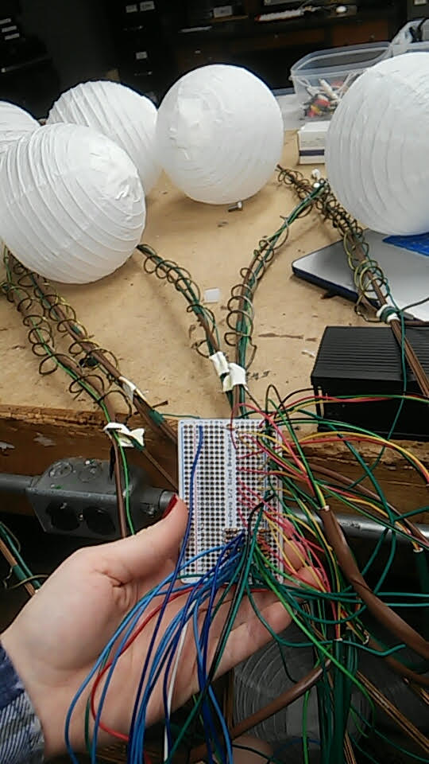
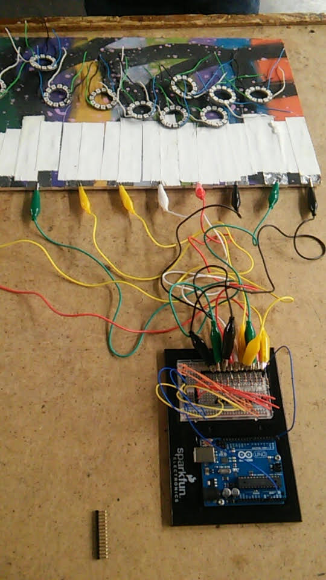
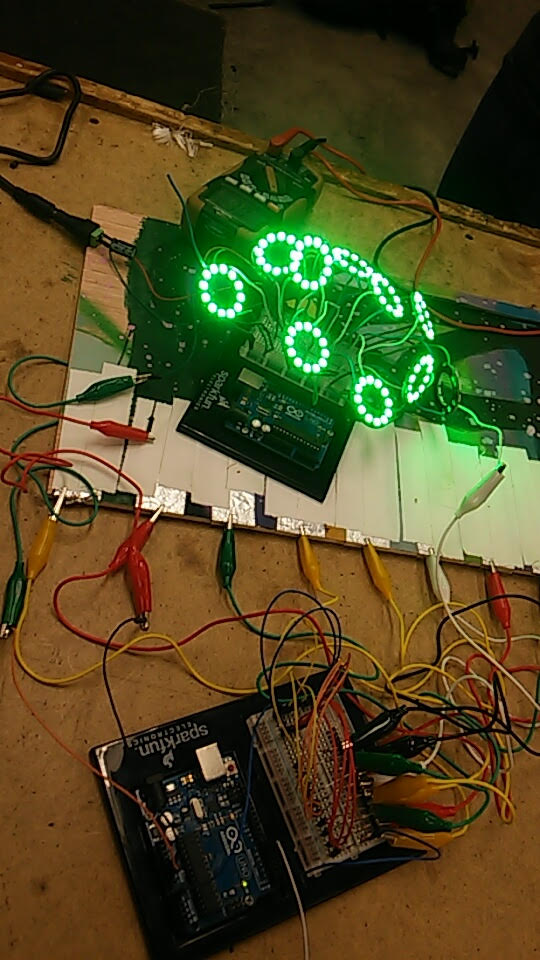
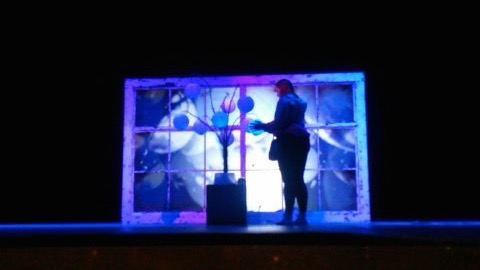

# Get in losers, we're going to the abyss
A case study in learning by collecting curious friends and doing something together that none of you know how to
*or the "you made your bed now lie in it" school of creative learning*

 In the fall of 2015, a couple motivated, intelligent, and curious students of mine approached me with a request to learn more about technological tools for interactive experiences. As an educator I am always energized and motivated by anyone who expresses a genuine desire to learn something. The topic hardly matters. If you approach me and say "Hey, I know nothing about topic *x* but would like to", be prepared as my instinctual response will be to grab you by the hand and leap head first into the abyss of the unknown, even if I know nothing about the topic myself. I'm not sure if these particular students knew that was the journey they were in for when they signed up or not, but it's definitely what they got. What follows are some notes on the details and thoughts on the outcome. 

 In this case, we had approximately a 15 week semester as our time window. We had a budget of $0. As resourceful theatre rats though, I had an electrics shop full of random parts, a brain full of tangentially related knowledge, and a willingness to try just about anything. 

 I wanted to make sure these students had ownership of the project and that my own excitement didn't trounce that into subservience. To this end, I made it clear on day one that this was their project and their choices. I would be availble as researcher and tech support. I wanted them to gain insights into all the thinking, experimentation, decision making, communication, and revision work that goes into a good creative tech project and not just focus on the technical skills. (For context, one student was a musician and writer and the other a set designer and painter)

 I set up some initial parameters:
 - They would have 1 week in the theatre at the end of the semester to install and exhibit their project to the public.
 - They would have 1 week at the beginning of the semester to brainstorm a concept and make their pitch.
 - I would say yes to whatever their pitch was with as few caveats as possible.

 They decided they were interested in playing with some specific technologies - LEDs, Projected Video, and Electronic Music. What they ultimately conceived of was "Max/MSTree" - an installation that would consist of a tree-like sculpture in the center of the stage that bore touch sensitive 'fruit' that would react to users and light up. The surrounding world would also have lighting and video elements that responded in some fashion to people interacting with the tree.  

 What we ultimately ended up with was a lovely tree scultpture made from recycled materials that held paper lanterns as the 'fruit'. Inside of each paper lantern we suspended a ring of RGB leds to color the lantern. We then connected the wire spring that provides structure to the lantern to an Arduino microcontroller to be used as a capacitive touch sensor. The Arduino served several purposes:
 - It polled the 'fruit' for changing capacitance values.
 - Updated the intensity/color of the leds inside the fruit based on the capacitance values. 
 - Took input from a large mushroom switch to allow users to cycle through color palettes.
 - Passed triggers from the mushroom switch to the theatrical lighting system to induce global changes
 - Serialized the capacitance data for each fruit and transmitted it via USB to a computer running Max/MSP

 Outside of the tree sculpture, we hung a plot of theatrical lighting fixtures that allowed us to change the color and feel of the space. We created several 'worlds' and stored these looks in the lighting console. Triggers from the mushroom switch were also serialized into the USB stream to the central computer which were then formatted and transmitted to the theatrical lighting console via UDP to change the lighting in the room. We also installed a flexible 'gooseneck' USB webcam to capture video of the tree and the users. This video was passed through a series of modules in another Max/MSP instance to apply various artistic effects which were projected near the tree. The idea was that by manipulating the camera, users could 'change their perspective' (label on the camera), and by pressing the mushroom switch they could 'change their world'. 

 The soundscape in the space was procedurally generated synthesis using the numeric values from the capacitance sensors to seed and manipulate the music using Max/MSP. It also took 'theming' parameters from the current 'world' selection made via the mushroom switch. 

 This process was successful in both product and process. It had a lot of complex interactions and interconnected technical parts and was very well received by those who experienced it. More importantly though, almost all of the technical requirements of the installation were well beyond any scope of knowledge any of us had at the beginning of the 15 week process. So much valuable learning for myself as an educator and for these two brilliant students came out of the fact that we conceived of an idea that was well beyond any of our current areas of understanding or technical knowledge and had to figure out what strengths we each brought to the group and how we would collectively assemble the knowledge, resources, and skills needed to bring the vision to reality. 
 
 Those larger lessons about systems and complexity, creative vision and technical implementation, and collaboration and resource sharing were formative and signficant lessons I think we all carry with us in one way or another to this day that would not have presented themseleves in the same fashion if the project was more prescribed or bound to 'safe' areas of preexisting knowledge at its outset. I cannot recommend the process of grabbing some curious friends and diving into something way out at your edge together highly enough. Figure out what you're genuinely curious about, round up your curious friends, and dive into the abyss. The water's great in here. 
 
[Video of onstage testing](./mstree.mov)

Some proces pics from the students:

